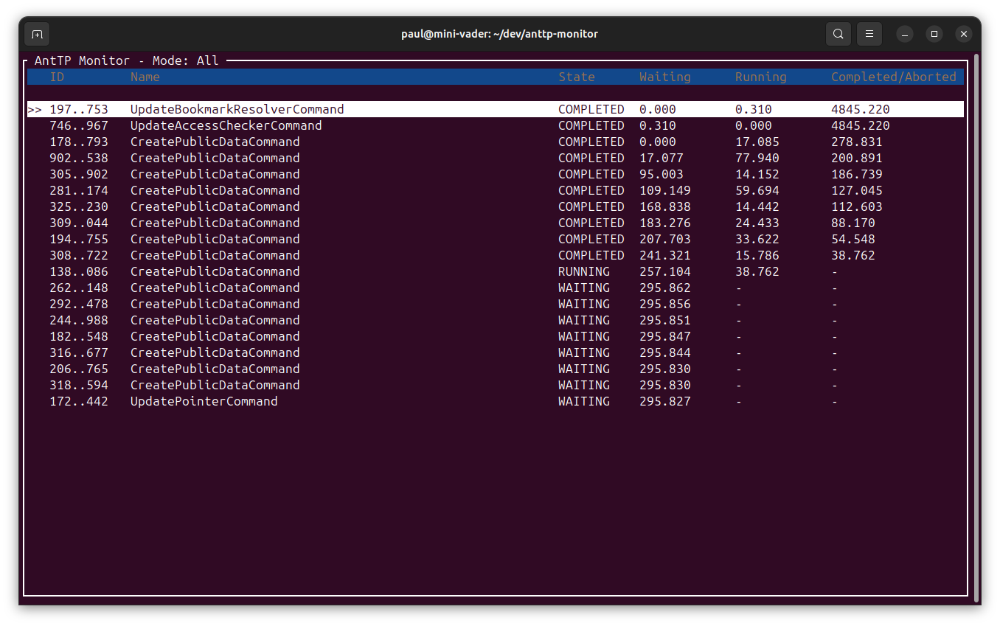

# AntTP Monitor

AntTP Monitor is a terminal-based application (TUI) used to monitor the status of an [AntTP](https://github.com/traktion/antftp) instance. It provides a real-time view of commands being processed by AntTP, allowing users to track their progress and inspect details.

## Features

- Real-time monitoring of AntTP commands.
- Filtering commands by state (Waiting, Running, Completed, Aborted).
- Detailed view for individual commands, including properties.
- Performance metrics such as waiting and running durations.

## Connection

The application connects to a local AntTP instance via gRPC. By default, it attempts to connect to `http://localhost:18887`. Ensure your AntTP instance is running and accessible at this address.

## Usage

Run the application using Cargo:

```bash
cargo run
```

### Keyboard Commands

The following keyboard commands are available within the application:

| Key                            | Action |
|--------------------------------|--------|
| `q`                            | Quit the application |
| `↑` / `k`                      | Move selection up |
| `↓` / `j`                      | Move selection down |
| `Enter`                        | View details of the selected command |
| `Backspace` / `Left` / `Enter` | Close the command details view |
| `d`                            | Filter: **Default** (show Waiting and Running commands) |
| `w`                            | Filter: **Waiting** commands |
| `r`                            | Filter: **Running** commands |
| `c`                            | Filter: **Completed** commands |
| `b`                            | Filter: **Aborted** commands |
| `a`                            | Filter: **All** commands |

## Screenshots



## Development

### Running Tests

To run the unit tests:

```bash
cargo test
```

Unit tests are located at the bottom of the associated production code files.
